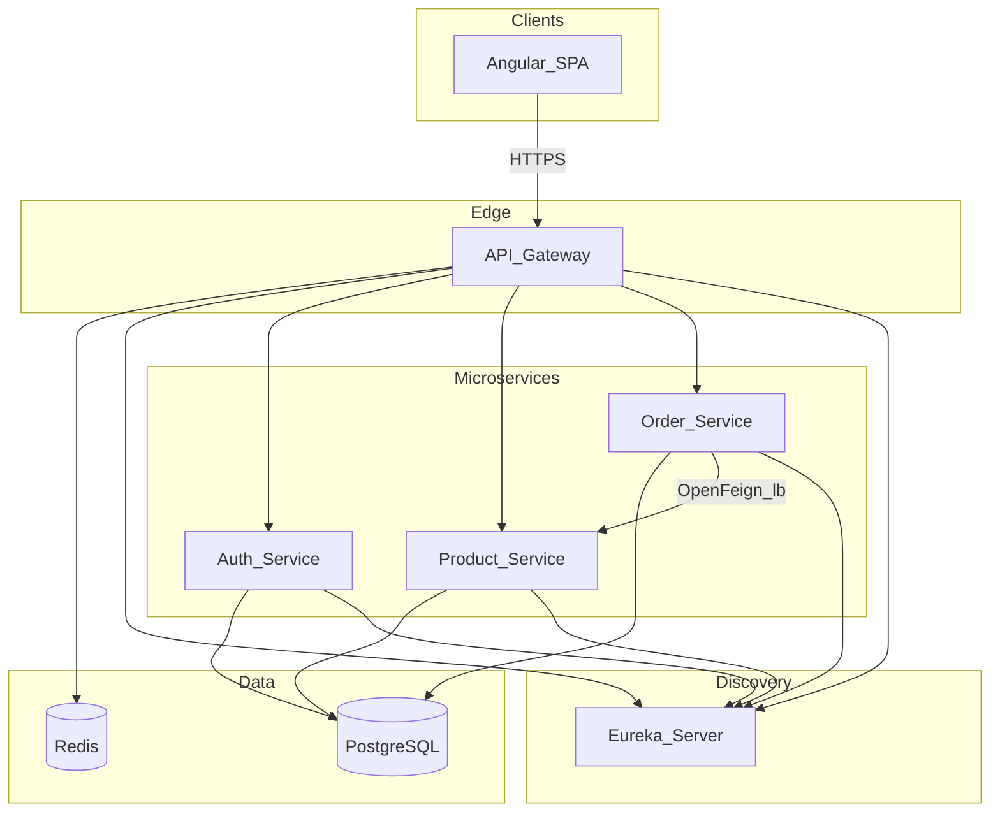

# Architecture

## Diagram

## Request flow

1. The browser talks only to the **API Gateway** (or nginx proxying `/api` to the gateway in Docker).
2. The gateway applies **Redis-backed rate limits** with keys based on **client IP** and **JWT subject** when a Bearer token is present.
3. Routes with a valid **`X-Gateway-Internal-Token`** matching `GATEWAY_INTERNAL_BYPASS_SECRET` skip rate limiting (trusted automation / internal tooling only).
4. Microservices register in **Eureka** and are reached via `lb://...` from the gateway.
5. **Checkout** is synchronous: the order service calls the product service **`POST /internal/inventory/commit`** (with `X-Service-Token`) to decrement stock in one transactional unit, then persists the order.

## Databases

Single PostgreSQL instance, schemas: `auth_schema`, `product_schema`, `order_schema` (Flyway per service).

## Out of scope (MVP)

Kafka/RabbitMQ, Kubernetes, full ELK/Prometheus stacks, distributed tracing, CQRS/event sourcing/sagas, OAuth2 social login, NgRx, WebSockets.
